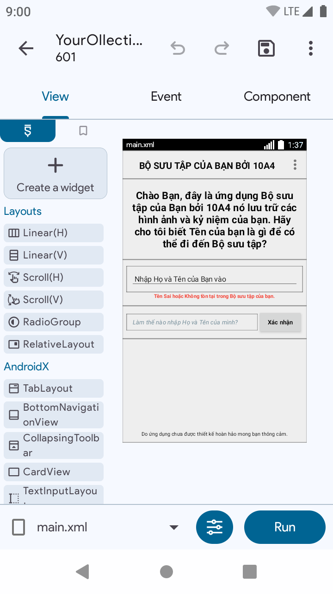
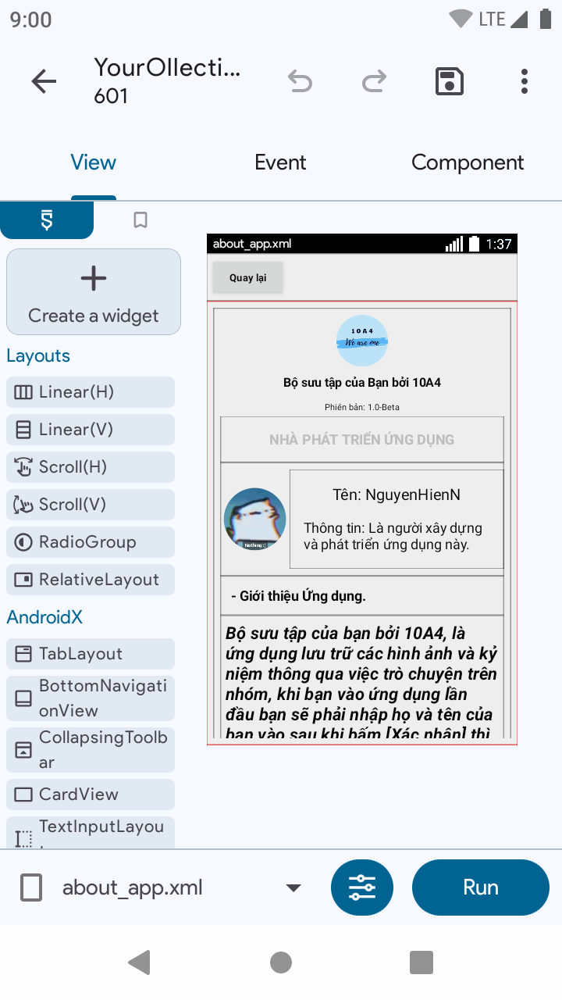

[%E2%81%A0_%E2%81%A0%2F%E2%81%A0%C2%AF)](https://git.io/typing-svg)

## Dự án Bộ sưu tập của Bạn dành cho 10A4

Là dự án lưu trữ những hình ảnh và kỷ niệm lên trên ứng dụng này thông qua việc trò chuyện trên ứng dụng như: Messager, Zalo,... Chúng tôi thu thập các hình ảnh và kỷ niệm đó để đưa lên ứng dụng nhằn xem lại những hình ảnh và kỷ niệm đáng nhớ trong những năm qua.

## Quá trình xây dựng ứng dụng

1. Ứng dụng xây dựng

Ứng dụng chúng tôi xây dựng đó chính là Sketchware, để mà nói Sketchware là ứng dụng xây dựng cơ bản cho phép chúng tôi lập trình và tạo ứng dụng Android mà không cần nhiều kiến thức chuyên sâu về lập trình. Đây là một ứng dụng có cách xây dựng dạng kéo thả giống như tạo một trò chơi trên trang web [Scratch](https://www.google.com/search?client=ms-android-samsung-ga-rev1&sca_esv=e095c950f9c2c4db&sxsrf=ADLYWIJqXG87cFF1TxesX12jC_yWv2HTWw:1734018500548&q=scratch&udm=2&fbs=AEQNm0D7NTKsOqMPi-yhU7bWDsijXeHIssQxQHiKhz3Orm0Szk2q6O3Esev6DIwpyqAb2BjXuzUhoSCU4R7jIJwKXYznPH2lW7oQcnijlNKyhRLD_iy-AMqbYySg1yETdDGkOCPzyyGBCE7ol03I13rjd-JZDlQzGpZM7U6YIadvhhj1QJ-YNRWgGD-1l3p_GsHwWbpQ4oA7GSn7AXZPjve060dfF0X6CM7K0iB623xIfuraxDHxFt-VPeyxz-VWO9u0ngO2nXLj&sa=X&sqi=2&ved=2ahUKEwj-gommyqKKAxUXc_UHHQ35H_EQtKgLegQIERAB&biw=412&bih=777&dpr=2.63) thì ứng dụng này có kiểu xây dựng tương tự như thế, nó giúp chúng tôi thiết kế giao diện và thiết lập một cách dễ dàng hơn. Nếu bạn muốn thử xây dựng ứng dụng dành cho riêng mình thì có thể đi đến đường liên kết [Tại đây!](https://sketchware.pro/) để có xây dựng ứng dụng dành cho riêng mình, tất nhiên bạn phải tìm hiểu cách xây dựng trước đã thông qua việc tìm kiếm trên mạng hoặc xem các video cách xây dựng ứng dụng bằng Sketchware. Đó là ứng dụng xây dựng của chúng tôi muốn chia sẻ. 

2. Xây dựng ứng dụng

Về quá trình xây dựng ứng dụng của chúng tôi thường diễn ra khá là khó khăn và có nhiều hạn chế về tính năng và bộ xây dựng của ứng dụng này. nhưng đây sẽ là những hình ảnh mà chúng tôi đã xây dựng trong tháng qua:

## Cài đặt ứng dụng

Để cài đặt ứng dụng này dành cho 10A4 hãy là các bước sau đây để cài đặt ứng dụng (Chỉ dành cho các thiết bị hệ điều hành Android)

Bước 1: Khi bạn đang ở trang chính của dự án hãy kéo xuống dưới sẽ có phần tên là Releases hay còn được gọi là Phát hành.

## Usage

Instructions on how to use your project and any relevant examples or screenshots.

## Contributing

Guidelines on how to contribute to your project and any specific requirements.

## License

This project is licensed under the [MIT License](LICENSE).

## Contact

If you have any questions or want to get in touch, you can reach me at [email@example.com](mailto:email@example.com).
